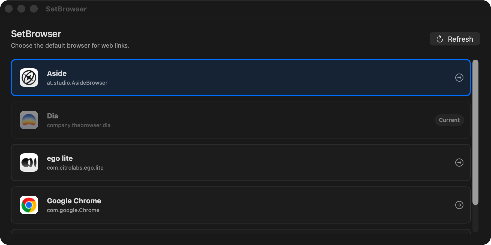

# SetBrowser

[English](README.md) | [한국어](README.ko.md)

macOS의 기본 브라우저를 변경하는 네이티브 앱과 CLI입니다.



현재 버전: `0.1.1`

## 요구 사항

- macOS 26+

## 주요 기능

SetBrowser는 웹 링크의 기본 macOS 브라우저만 변경합니다. 앱과 CLI는
`/Applications`와 `~/Applications`에 설치된 호환 브라우저를 찾은 뒤,
macOS에 `http`와 `https` 링크의 기본 애플리케이션 변경을 요청합니다.

기본 브라우저를 변경할 때 macOS 확인 창이 나타날 수 있습니다. 변경을
완료하려면 해당 창에서 승인해야 합니다.

## 개인정보 보호

SetBrowser는 로컬에서 동작하는 앱과 CLI입니다. 개인정보를 수집, 저장,
전송 또는 판매하지 않으며 telemetry나 analytics를 포함하지 않습니다.
방문 기록, 열어 본 URL, 계정 정보, 쿠키, 인증정보 또는 브라우저 데이터를
읽거나 전송하지 않습니다.

자세한 내용은 [PRIVACY.md](PRIVACY.md)를 참고하세요.

## 빌드

```sh
swift build
```

## CLI

```sh
swift run setbrowser list
swift run setbrowser chrome
swift run setbrowser 1
```

## 앱

SwiftPM에서 SwiftUI 앱을 실행합니다.

```sh
swift run SetBrowserApp
```

로컬 `.app` 번들을 생성하고 실행합니다.

```sh
./scripts/build-app-bundle.sh
open dist/SetBrowser.app
```

앱 번들을 만들 때 `Assets/AppIcon/setbrowser-icon.png`를 사용해
`SetBrowser.icns`를 생성합니다.

### 설정

`SetBrowser > Settings...`에서 앱 동작을 설정할 수 있습니다.

- `Show alerts only when a change fails`: 변경에 성공하면 팝업 없이 목록만
  갱신하고, 변경에 실패하면 alert를 표시합니다.
- `Quit SetBrowser after a successful change`: 선택한 브라우저가 기본
  브라우저로 확인되면 앱을 자동으로 종료합니다.

두 설정은 서로 독립적으로 동작합니다. 기본 브라우저를 변경할 때 macOS가
자체 확인 창을 표시할 수 있습니다. 이 시스템 창은 SetBrowser alert와
별개이며, 변경을 완료하려면 사용자가 승인해야 합니다.

## CLI 설치

```sh
./scripts/install-cli.sh
```

다른 경로에 설치하려면 `PREFIX`를 지정합니다.

```sh
PREFIX="$HOME/.local/bin" ./scripts/install-cli.sh
```

## 릴리즈

앱과 CLI의 릴리즈 압축 파일을 생성합니다.

```sh
./scripts/build-release.sh
```

산출물은 `dist/release/<version>/`에 생성됩니다.

## 배포 및 실행 안내

현재 릴리즈 빌드는 Developer ID로 서명되거나 notarization되지 않았습니다.
GitHub에서 다운로드한 앱을 처음 실행할 때 macOS Gatekeeper 경고가 나타날
수 있습니다.

이 저장소에서 직접 다운로드했고 해당 파일을 신뢰하는 경우에만 실행하세요.

앱 릴리즈를 실행하는 방법은 다음과 같습니다.

1. `SetBrowser-<version>-macOS-app.zip`의 압축을 풉니다.
2. `SetBrowser.app`을 `/Applications`로 이동합니다.
3. `SetBrowser.app`을 한 번 실행합니다.
4. macOS가 실행을 차단하면 `System Settings > Privacy & Security`를 엽니다.
5. SetBrowser 관련 경고를 찾아 `Open Anyway`를 선택합니다.

macOS에서 `SetBrowser.app`이 손상되어 휴지통으로 이동해야 한다고 표시한다면,
다운로드한 앱에 quarantine 속성이 남아 있을 수 있습니다. 파일을 신뢰하는
경우에만 다음 명령으로 이 앱의 quarantine 속성을 제거하세요.

```sh
xattr -dr com.apple.quarantine /Applications/SetBrowser.app
open /Applications/SetBrowser.app
```

Gatekeeper를 시스템 전체에서 비활성화하지 마세요.

CLI 릴리즈는 `setbrowser-<version>-macOS-cli.zip`의 압축을 푼 뒤 직접
설치합니다.

```sh
cd setbrowser-cli-<version>
cp setbrowser /usr/local/bin/
```

서명되지 않은 다운로드 CLI 바이너리를 macOS가 차단한다면 소스에서 직접
빌드하는 방식을 권장합니다.

```sh
swift build -c release --product setbrowser
```

다운로드한 CLI 바이너리를 그대로 실행하려면 신뢰할 수 있는 파일인지 확인한
뒤 해당 바이너리의 quarantine 속성만 제거하세요.

```sh
xattr -d com.apple.quarantine ./setbrowser
./setbrowser list
```

SetBrowser는 Apple, Google, Dia, The Browser Company 또는 기타 브라우저
제조사와 제휴하거나 이들로부터 보증 또는 후원받지 않습니다.

## 라이선스

SetBrowser는 MIT License로 배포되며 어떠한 보증 없이 있는 그대로
제공됩니다. 자세한 내용은 [LICENSE](LICENSE)를 참고하세요.
